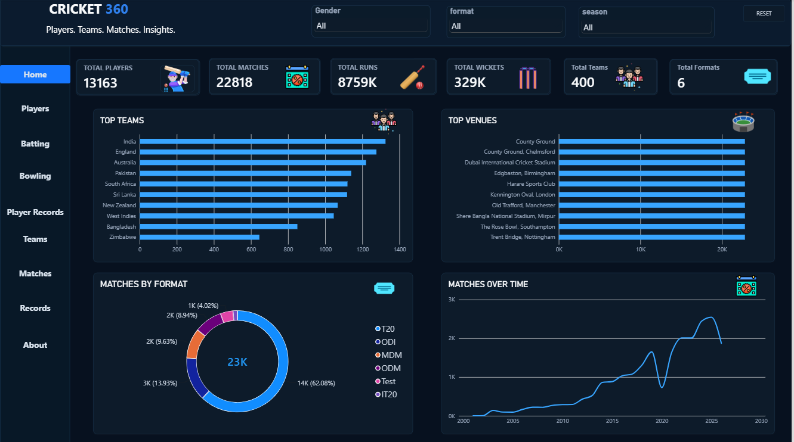
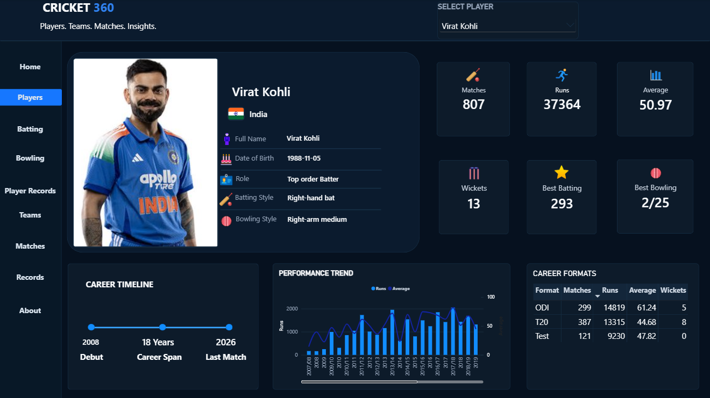
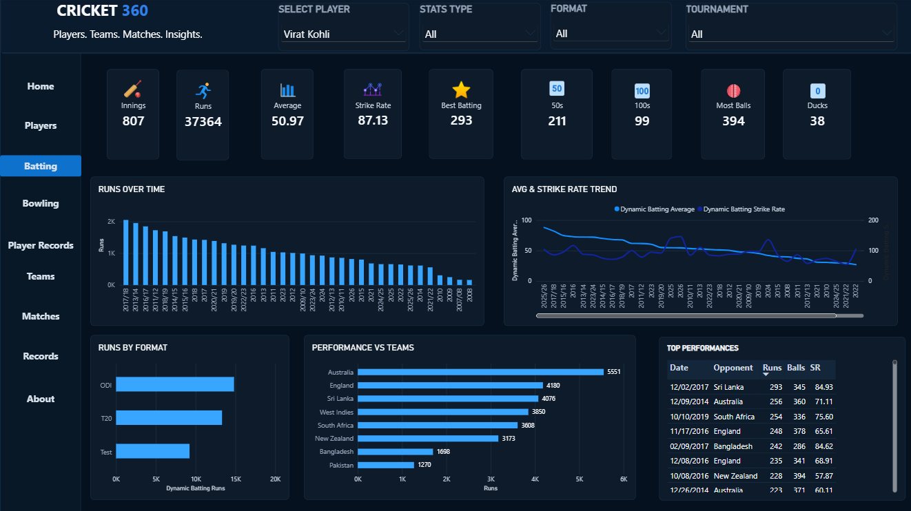
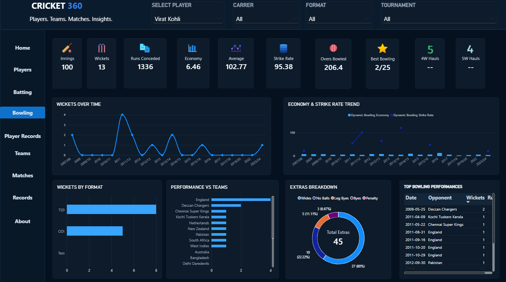
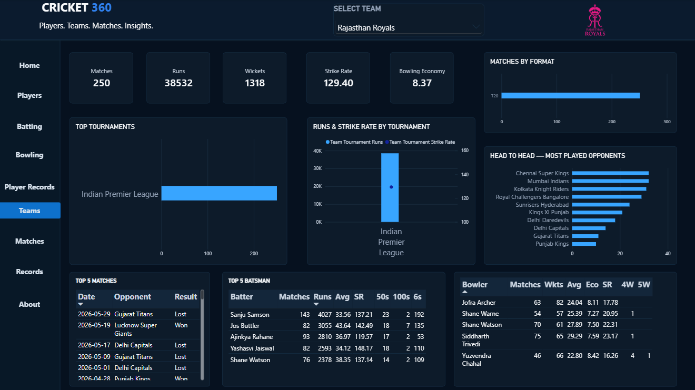
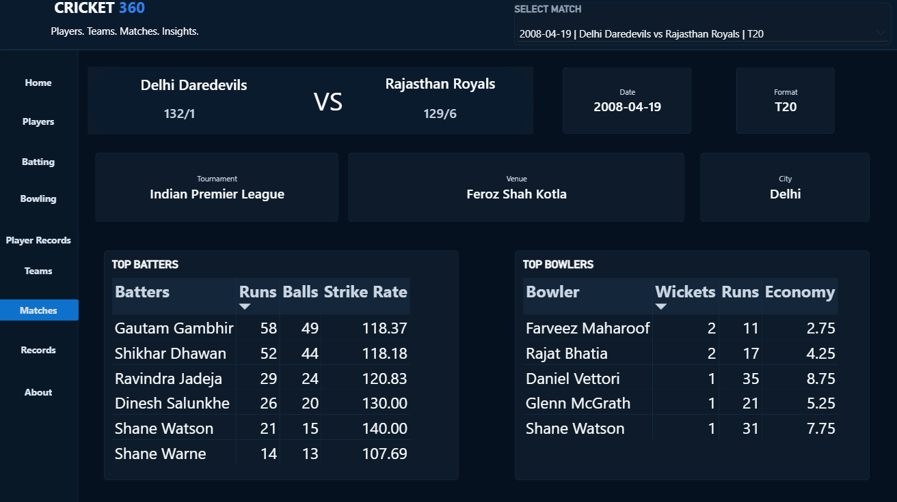
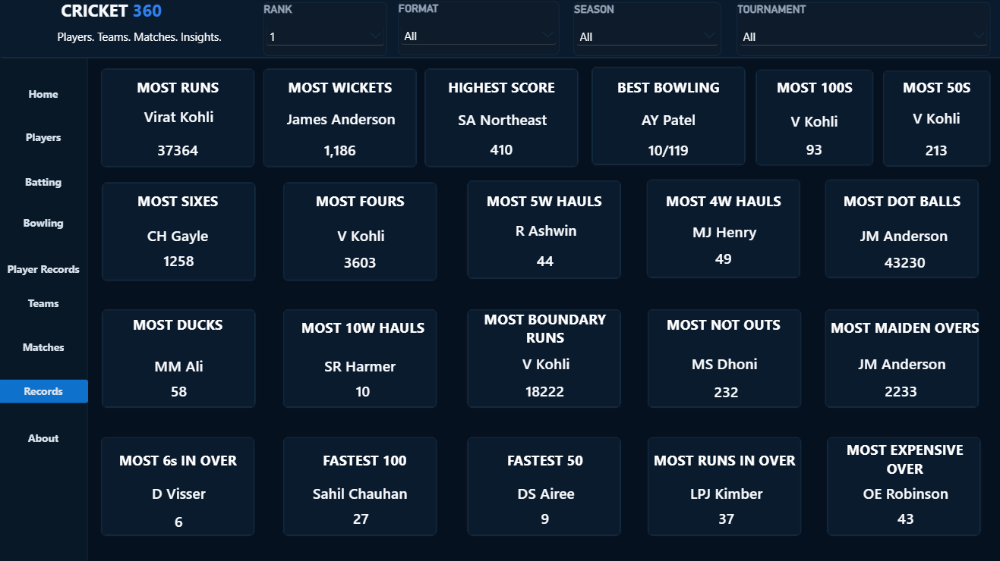

# 🏏 CRICKET 360 — End-to-End Cricket Analytics Platform


## 📌 Project Overview

**CRICKET 360** is an end-to-end cricket analytics project built to transform large-scale historical cricket data into an interactive analytical platform.

The project covers the complete workflow:

**Raw Cricket Data → Data Cleaning → Player Identity Resolution → Data Enrichment → Validation → Analytical Data Model → Power BI Dashboard**

The final dashboard provides analysis across:

- Players
- Batting
- Bowling
- Teams
- Matches
- Player Records
- Cricket Records
- Career & Form Trends
- Tournament and Format Performance

The objective was not simply to build a dashboard, but to develop a structured analytics pipeline capable of converting millions of cricket records into meaningful and interactive insights.

---

# 📊 Project Scale

The production analytical dataset contains:

| Dataset | Records |
|---|---:|
| Ball-by-Ball Deliveries | **11,539,809** |
| Matches | **22,818** |
| Players | **13,213** |
| Batting Fact Records | **428,302** |
| Bowling Fact Records | **298,575** |
| Player-Match Batting Records | **384,274** |
| Player-Match Bowling Records | **274,065** |
| Batter vs Bowler Records | **660,982** |
| Player vs Team Records | **130,959** |
| Player vs Tournament Records | **68,671** |
| Player Career by Format Records | **21,363** |

This scale required preprocessing and aggregation in Python before visualization in Power BI.

---

# 🗂️ Data Sources

The project combines structured cricket match data with player identity and metadata from multiple cricket-related sources.

### Primary Match Data

**Cricsheet** was used as a major structured source for cricket match and player identity information.

The project processes structured match data into production datasets such as:

- Match-level data
- Ball-by-ball deliveries
- Batting performances
- Bowling performances
- Player-match statistics
- Team statistics
- Tournament statistics
- Head-to-head records

### Player Metadata & Identity Enrichment

Player identities and metadata were reconciled using information and identifiers associated with sources including:

- **Cricsheet**
- **ESPN / Cricinfo**
- **Cricbuzz**
- **CricHeroes**
- **Wikimedia**

Additional identifiers available in source metadata were also used during identity-resolution and audit workflows.

Instead of depending only on player names, the pipeline used available IDs, normalized names and cross-source mappings wherever possible to reduce incorrect player matches.

> External sources remain the property of their respective owners. This repository is intended as an analytics/portfolio project and does not redistribute the complete source datasets.

---

# ⚙️ Data Engineering Pipeline

A significant part of CRICKET 360 was built in **Python using Pandas**.

## 1️⃣ Raw Data Processing

Raw match information was converted into structured analytical tables.

The pipeline extracted information including:

- Match IDs
- Dates
- Formats
- Seasons
- Teams
- Innings
- Batters
- Bowlers
- Runs
- Balls faced
- Boundaries
- Wickets
- Extras
- Venues
- Opponents

---

## 2️⃣ Ball-by-Ball Transformation

More than **11.5 million delivery records** were processed.

Ball-level information was aggregated to create reusable batting and bowling fact tables.

Examples of derived batting metrics:

- Runs
- Balls Faced
- Fours
- Sixes
- Strike Rate
- Dismissals
- Not Outs

Examples of derived bowling metrics:

- Wickets
- Runs Conceded
- Legal Balls
- Economy Rate
- Bowling Strike Rate
- Extras Conceded

---

## 3️⃣ Player Dimension Creation

Player names appearing across batting, bowling and ball-by-ball datasets were consolidated into a central player dimension.

This created a consistent analytical key for thousands of players and reduced dependency on raw text names throughout the model.

---

## 4️⃣ Player Identity Resolution

One of the more challenging parts of the project was resolving players across different data sources.

Different sources can contain:

- Abbreviated names
- Alternate spellings
- Duplicate names
- Different player IDs
- Missing metadata

The identity pipeline therefore used combinations of:

- Player IDs
- Cricsheet identifiers
- Cricinfo identifiers
- Normalized names
- Alternate IDs
- Source reconciliation

Ambiguous mappings were audited instead of automatically overwriting production records.

---

## 5️⃣ Metadata Enrichment

The player dimension was progressively enriched with attributes such as:

- Full Name
- Country
- Date of Birth
- Playing Role
- Batting Style
- Bowling Style
- Career information
- Player images where safely available

Enrichment was performed through multiple controlled processing passes rather than a single uncontrolled merge.

---

## 6️⃣ Validation & Audit Framework

Data quality was treated as a separate stage of the project.

Python audit scripts were used to detect issues such as:

- Missing values
- Duplicate identities
- Conflicting player mappings
- Duplicate URLs
- Invalid metadata
- Cross-source disagreements
- Unresolved records

Production updates used validation rules and controlled overwrite logic to avoid replacing trusted information with weaker matches.

---

# 🧱 Analytical Data Model

The cleaned data was transformed into purpose-built analytical tables instead of forcing Power BI to repeatedly calculate everything from raw delivery-level data.

Examples include:

### Player Analytics
- Player Summary
- Player Career by Format
- Player by Season
- Player vs Team
- Player vs Tournament

### Match-Level Analytics
- Match Summary
- Player Match Batting
- Player Match Bowling

### Advanced Cricket Analytics
- Batter vs Bowler
- Batting Form Trends
- Bowling Form Trends
- Head-to-Head Summary

### Team & Competition Analytics
- Team Summary
- Team vs Tournament
- Tournament Summary
- Season Summary
- Venue Summary
- Format Summary

This architecture improves dashboard usability and keeps business logic organized.

---

# 📈 Power BI Dashboard

CRICKET 360 contains **9 interactive Power BI pages**.

## 🏠 Home

High-level overview of the cricket dataset and major KPIs.

## 👤 Players

Interactive player profile containing:

- Player image
- Country
- Full name
- Date of birth
- Role
- Batting style
- Bowling style
- Matches
- Runs
- Average
- Wickets
- Best performances
- Career timeline
- Performance trend
- Career statistics by format

## 🏏 Batting

Analysis of batting performance including runs, averages, strike rates, boundaries and performance trends.

## 🎯 Bowling

Bowling analytics including wickets, economy, strike rate and bowling performance trends.

## 🏆 Player Records

Comparison and exploration of major player records.

## 👥 Teams

Team-level analysis including:

- Matches
- Runs
- Wickets
- Strike Rate
- Economy
- Tournament performance
- Format performance
- Head-to-head opponents
- Top batsmen
- Top bowlers
- Recent matches

## 🗓️ Matches

Match-level exploration and filtering.

## 🥇 Records

Major statistical records extracted from the analytical model.

## ℹ️ About

Project information, scope and dashboard context.

---

# 🖼️ Dashboard Preview

## Home



## Player Analytics



## Batting Analytics



## Bowling Analytics



## Teams Analytics



## Matches



## Records



---

# 🤖 AI-Assisted Development

AI tools were used as a **development assistant** during the project rather than as a replacement for the underlying cricket data.

AI-assisted workflows helped with areas such as:

- Brainstorming data-engineering approaches
- Designing processing workflows
- Drafting and refining Python scripts
- Debugging errors
- Reviewing transformation logic
- Developing validation strategies
- Exploring DAX approaches
- Improving dashboard structure
- Troubleshooting Power BI issues
- Documentation and project organization

All analytical outputs were ultimately based on the structured cricket datasets and programmatic transformations.

AI-generated values were **not used as a substitute for cricket statistics**.

This project demonstrates a practical workflow where **Python + Power BI + AI-assisted development** are combined to accelerate the analytics development lifecycle while keeping the underlying data pipeline reproducible and auditable.

---

# 🛠️ Technology Stack

| Technology | Purpose |
|---|---|
| **Python 3.12** | Data processing & automation |
| **Pandas** | Cleaning, transformation & aggregation |
| **Power BI** | Data modeling & visualization |
| **DAX** | Measures and analytical calculations |
| **Power Query** | Data loading & transformation |
| **CSV / Structured Data** | Analytical storage |
| **Git / GitHub** | Version control & project documentation |
| **AI Assistance** | Development, debugging & workflow support |

---

# 📐 Key Analytical Metrics

The project calculates and analyzes metrics including:

### Batting
- Runs
- Matches
- Batting Average
- Strike Rate
- Fours
- Sixes
- 50s
- 100s
- Best Scores

### Bowling
- Wickets
- Bowling Average
- Economy Rate
- Bowling Strike Rate
- Four-Wicket Hauls
- Five-Wicket Hauls
- Best Bowling

### Team / Match
- Matches Played
- Runs
- Wickets
- Tournament Performance
- Format Performance
- Head-to-Head Analysis
- Recent Match Performance

---

# 📁 Repository Structure

```text
CRICKET-360/
│
├── README.md
│
├── dashboard/
│   ├── home.png
│   ├── players.png
│   ├── batting.png
│   ├── bowling.png
│   ├── player-records.png
│   ├── teams.png
│   ├── matches.png
│   └── records.png
│
├── src/
│   └── Python data-processing scripts
│
├── data/
│   └── sample/
│       └── Small sample datasets
│
├── docs/
│   ├── data_dictionary.md
│   └── dax_measures.md
│
├── requirements.txt
└── .gitignore
```

---

# 🔍 Key Challenges Solved

### Large Dataset Processing
Processing millions of delivery-level records efficiently before visualization.

### Player Identity Resolution
Reconciling players across multiple cricket metadata sources and identifier systems.

### Missing Metadata
Building controlled enrichment pipelines for incomplete player information.

### Data Quality
Creating audit workflows to prevent unsafe automatic updates.

### Power BI Performance
Creating aggregated analytical tables rather than relying entirely on raw ball-by-ball calculations.

### Dynamic Dashboard Experience
Building interactive player and team views that respond to slicer selections.

---

# 🎯 Project Objective

CRICKET 360 was developed as a practical end-to-end **Data Analytics / Business Intelligence project** demonstrating skills across:

**Data Collection → Data Engineering → Data Cleaning → Data Validation → Data Modeling → Statistical Analysis → Visualization → Dashboard Development**

---

# 👨‍💻 Author

**Priyansh Agarwal**

Data Analyst | Python | Power BI | Data Visualization

---

⭐ If you find this project interesting, feel free to star the repository.
